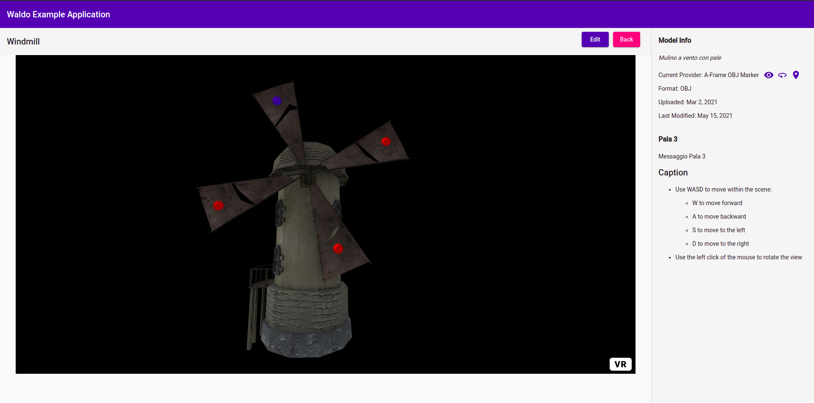

# Waldo (Front-End Module)

Front-End module for model rendering and information marking. 

The Waldo Module provides the user with the possibility to manage both 2D (i.e. digital images) and 3D models, render them into a web-based environment (using Providers) and place some markers on them.

### Supported (and Tested) Formats

- png
- obj+mtl
- gltf

## Available Providers

- **Native HTML**
  - *HTML Image View*: simple 2D image view using the  tag.
- **HTML + Leaflet**
  - *HTML Image Marker*: 2D image view (using <canvas> tag) and marking using Leaflet.
- **ThreeJS**
  - OBJ Model Viewer: view 3D models in OBJ+MTL format. 
  - *OBJ Model Navigator*: view and navigate 3D models in OBJ+MTL format.
  - *OBJ Model Marker*: view, navigate, and markup 3D models in OBJ+MTL format.
  - *GLTF Model Viewer*: view 3D models in GLTF format.
  - *GLTF Model Navigator*: view and navigate 3D models in GLTF format.
  - OBJ Model Viewer: view 3D models in OBJ+MTL format. 
  - *OBJ Model Navigator*: view and navigate 3D models in OBJ+MTL format.
  - *OBJ Model Marker*: view, navigate, and markup 3D models in OBJ+MTL format.
  - *GLTF Model Viewer*: view 3D models in GLTF format.
  - *GLTF Model Navigator*: view and navigate 3D models in GLTF format.
  - *GLTF Model Marker*: view, navigate, and markup 3D models in GLTF format.
  - *GLTF Model Marker*: view, navigate, and markup 3D models in GLTF format.
- **A-Frame**
  - OBJ Model Viewer: view 3D models in OBJ+MTL format. 
  - *OBJ Model Navigator*: view and navigate 3D models in OBJ+MTL format.
  - *OBJ Model Marker*: view, navigate, and markup 3D models in OBJ+MTL format.
  - *GLTF Model Viewer*: view 3D models in GLTF format.
  - *GLTF Model Navigator*: view and navigate 3D models in GLTF format.
  - *GLTF Model Marker*: view, navigate, and markup 3D models in GLTF format.

## Installalation

### Dependencies

- [Node.js](https://nodejs.org/en/)
- [npm](https://docs.npmjs.com/about-npm)
- Angular CLI: `npm install -g @angular/cli`
- [Json-Server](https://github.com/typicode/json-server) (for mocked backend)

## Run in a local environment (for test purposes)

- Clone this repository
- Go to the downloaded directory
- Open two terminal windows/tabs:
  - In one window/tab, run `ng serve`
  - In the other:
    - go to the `mocked-server` directory
    - run `json-server --watch waldo-db.json`

## Screenshots

## TO DO

### Documentazione

- Motivare abbandono provider WebGL+Leaflet e mancato utilizzo di Babylon
- Ridefinire la sezione API:
  - relazione
  - presentazione

### Presentazione

- Mettere in pari con SDD
