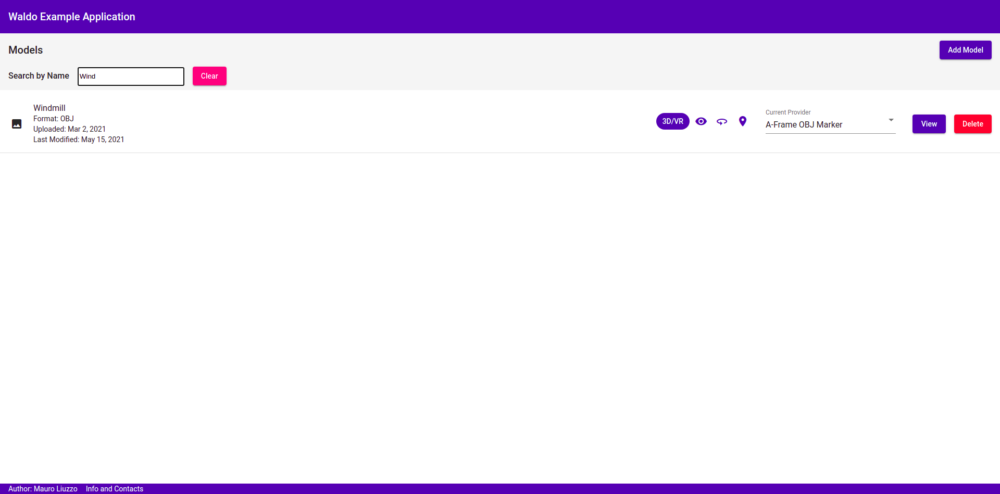
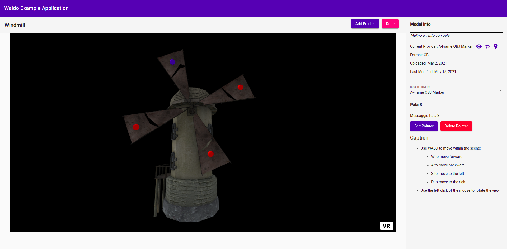

# Waldo (Front-End Module)

Front-End module for model rendering and information marking. 

The Waldo Module provides the user with the possibility to manage both 2D (i.e. digital images) and 3D models, render them into a web-based environment (using Providers) and place some markers on them.

### Supported (and Tested) Formats

- png
- obj+mtl
- gltf

## Available Providers

- **Native HTML**
  - *HTML Image View*: simple 2D image view using the  tag.
- **HTML + Leaflet**
  - *HTML Image Marker*: 2D image view (using <canvas> tag) and marking using Leaflet.
- **ThreeJS**
  - OBJ Model Viewer: view 3D models in OBJ+MTL format. 
  - *OBJ Model Navigator*: view and navigate 3D models in OBJ+MTL format.
  - *OBJ Model Marker*: view, navigate, and markup 3D models in OBJ+MTL format.
  - *GLTF Model Viewer*: view 3D models in GLTF format.
  - *GLTF Model Navigator*: view and navigate 3D models in GLTF format.
  - OBJ Model Viewer: view 3D models in OBJ+MTL format. 
  - *OBJ Model Navigator*: view and navigate 3D models in OBJ+MTL format.
  - *OBJ Model Marker*: view, navigate, and markup 3D models in OBJ+MTL format.
  - *GLTF Model Viewer*: view 3D models in GLTF format.
  - *GLTF Model Navigator*: view and navigate 3D models in GLTF format.
  - *GLTF Model Marker*: view, navigate, and markup 3D models in GLTF format.
  - *GLTF Model Marker*: view, navigate, and markup 3D models in GLTF format.
- **A-Frame**
  - OBJ Model Viewer: view 3D models in OBJ+MTL format. 
  - *OBJ Model Navigator*: view and navigate 3D models in OBJ+MTL format.
  - *OBJ Model Marker*: view, navigate, and markup 3D models in OBJ+MTL format.
  - *GLTF Model Viewer*: view 3D models in GLTF format.
  - *GLTF Model Navigator*: view and navigate 3D models in GLTF format.
  - *GLTF Model Marker*: view, navigate, and markup 3D models in GLTF format.

## Installalation

### Dependencies

- [Node.js](https://nodejs.org/en/)
- [npm](https://docs.npmjs.com/about-npm)
- Angular CLI: `npm install -g @angular/cli`
- [Json-Server](https://github.com/typicode/json-server) (for mocked backend)

## Run in a local environment (for test purposes)

- Clone this repository
- Go to the downloaded directory
- Open two terminal windows/tabs:
  - In one window/tab, run `ng serve`
  - In the other:
    - go to the `mocked-server` directory
    - run `json-server --watch waldo-db.json`

## Screenshots

## Useful Links

## Internal References

### Development Documentation

[Application Domain Approach Document (in Italian)](https://docs.google.com/document/d/1v4c6Lw_ve_vWkJD5geaZmOb3pAjJ_ywr05ypYWhyF80/edit?usp=sharing)

[Requirement Analysis Document (in Italian)](https://docs.google.com/document/d/1bK4TXn0a3MahPh3NU0xLFEtQaIAg3j-BHuN6jNwv_Ug/edit?usp=sharing)

[System Design Document (in Italian)](https://docs.google.com/document/d/1agmJ1j1ONknTfrMZRue9bPpEqKIrOmg-Fmp8lrAh6ps/edit?usp=sharing)

[Slides (in Italian)](https://docs.google.com/presentation/d/12gzmdHwjSXxvdBrcP9yiJ0UpWuDMqIrd5RrxXYH-9GE/edit?usp=sharing)

[Report (in Italian)](https://docs.google.com/document/d/1dTNXM0UCosM6kbW5kNpf_1ZmmZQyHuPNRl69IcrgJvo/edit?usp=sharing)

### Contacts

[Open an Issue](https://github.com/liuzzom/waldo-front-end/issues)

[Author Github Profile](https://github.com/liuzzom)

## External References

[Leaflet Documentation](https://leafletjs.com/reference-1.7.1.html)

[WebGL Specification](https://www.khronos.org/registry/webgl/specs/1.0/)

[ThreeJS Documentation](https://www.khronos.org/registry/webgl/specs/1.0/)

[A-Frame Documentation](https://aframe.io/docs/1.2.0/introduction/)

[JSON-Server](https://github.com/typicode/json-server)